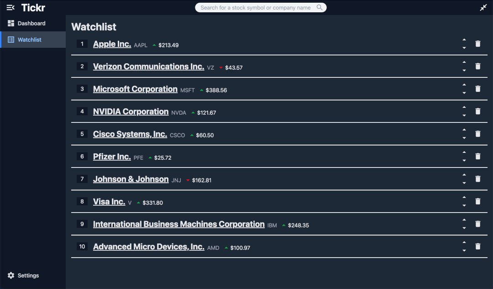

# Tickr: Stock Market Tracking App

## Overview

_Tickr_ is a simple, lightweight app to track the performance of stocks.

_Note:_ This app was created as a personal project and does not _yet_ provide real-time data

## Getting Started

### Installation

### Loading Demo Data

To load demo data, navigate to the `Help` menu, then click `Load Demo Data`.

### Dashboard

The Dashboard shows at-a-glance information about the tickers on your watchlist.


### Ticker Information

Search for a ticker by it's symbol, the company name, or by industry or sector. Click on the company's name you would like to view to open the Ticker Information page.


### Watchlist

The Watchlist contains a list of tickers you want to keep track of.



To add a ticker to your watchlist, search for a ticker, then click `+ Add to Watchlist` on either the Search Results page or the Ticker Information page.

### Tickr Mode

_Tickr Mode_ provides a small scrolling ticker of the stocks on your watchlist. To enter _Tickr Mode_, click the arrows in the upper right of the screen. To exit _Tickr Mode_, click the same area to the right of the ticker.

## Building from Source

### Cloning the Repository

In a terminal, run the following:

```shell
git clone https://github.com/psilentrain1/jmdm-apps-tickr.git
```

Open the resulting folder:

```shell
cd jmdm-apps-tickr
```

### Installing Dependencies

In a terminal at the root of the project, run one of the following.

```shell
# Using npm
npm install

# Using yarn
yarn install

# Using pnpm
pnpm install
```

### Changing the Database Location

By default, the database will be initialized in `database location`.

To change the location of the database,

### Building the App
